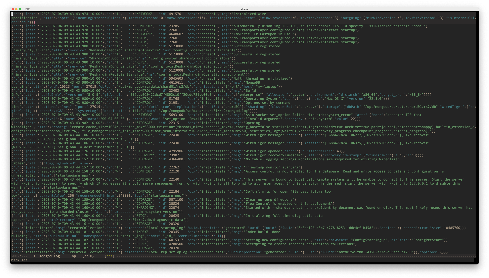
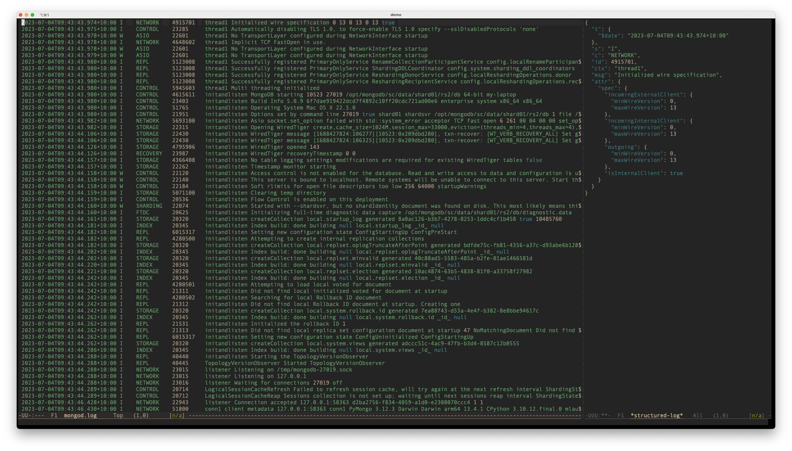

# Structured Log Mode #

An Emacs minor mode that displays log files formatted as JSON Lines in a more
human-friendly format.

While JSON Lines format is easy to parse by machines, it is not very human
friendly due to the extra punctuation and keys. This mode tries to make it
easier to read by
- hiding the punctuation and keys;
- pretty printing the line at cursor in an associated side window.

## Screenshots ##

Below are screenshots of viewing a MongoDB log file without and with this mode.
- Before the `structured-log-mode` is enabled:
  

- After the `structured-log-mode` is enabled:
  

## Prerequisites ##

- Emacs 29.1 or later

  This package uses the Emacs built-in packages `treesit` and the
  `json-ts-mode`, which are available since Emacs 29.1. Too double check if your
  Emacs has built in `treesit` support, please evaluate `(treesit-available-p)`.

## Installation ##

1. Git clone or download this repository.

2. Edit your Emacs init file to load it.

    If you are using `use-package`, you can add the following code to your init
    file:

        ```elisp
        (use-package structured-log-mode
          :load-path "/path/to/structured-log-mode"
          :commands structured-log-mode)

        (use-package json-ts-mode
          :mode "\\.jsonl?\\'" "mongod*\\.log"
          )
        ```

    Note that the second `use-package` is optional. It tells Emacs to open
    MongoDB log files using `json-ts-mode`.

    If you are not using `use-package`, please add the following code to your
    init file:

        ```elisp
        (add-to-list 'load-path "/path/to/structured-log-mode")
        (require 'structured-log-mode)

        ```

3. If haven't done yet, install the corresponding tree-sitter grammar by running
   `M-x treesit-install-grammars` and selecting `json` from the list.

4. Restart Emacs or run `M-x load-file` on your init file.

## Usage ##

1. Open a log file that is formatted as JSON Lines. If its major mode is not
   `json-ts-mode`, run `M-x json-ts-mode` to enable it.

2. Enable the `structured-log-mode` by running `M-x structured-log-mode`.

3. The log file should now be displayed in a more human-friendly format.

4. Move the cursor to a line to see the corresponding JSON data in the side
   window.

5. Press `c-c c-s` to show all the original contents. Press `c-s c-h` to hide
   again.

6. Run `M-x structured-log-mode` again to disable the mode.

## Customization ##

None at the moment.

## TODO ##

- [ ] Investigate if `json-ts-mode` parse the whole file all at once. If so,
  remove the dependency on it to avoid performance issues for large files.
- [ ] Better whitespace handling.
- [ ] Highlight according to log level.
- [ ] Add customization options.
